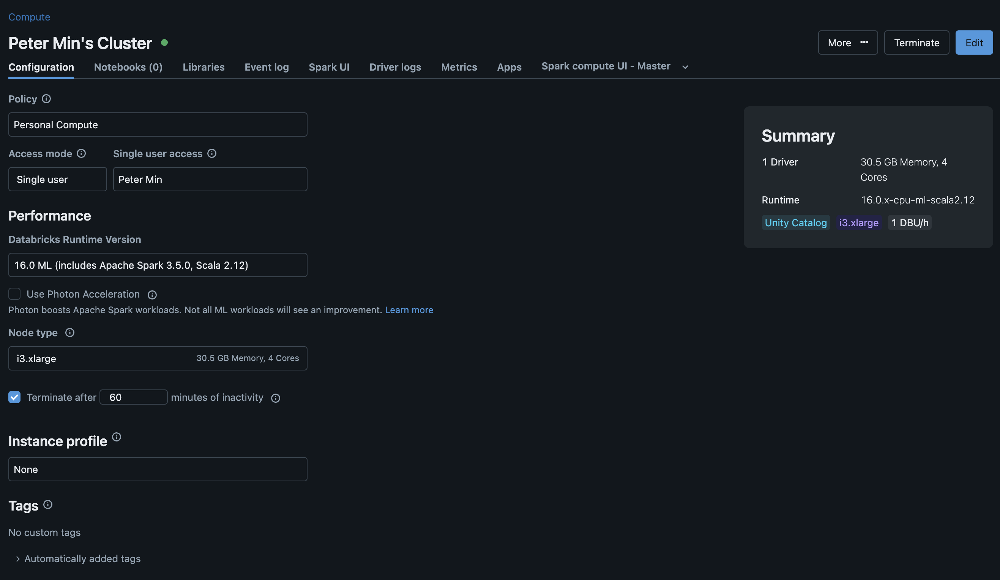
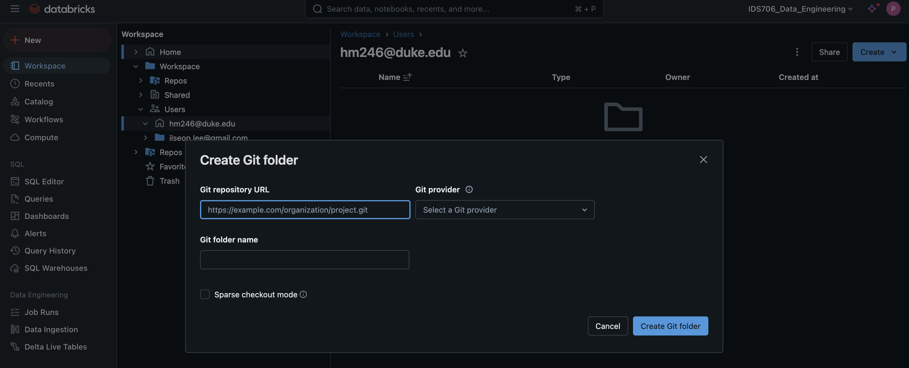
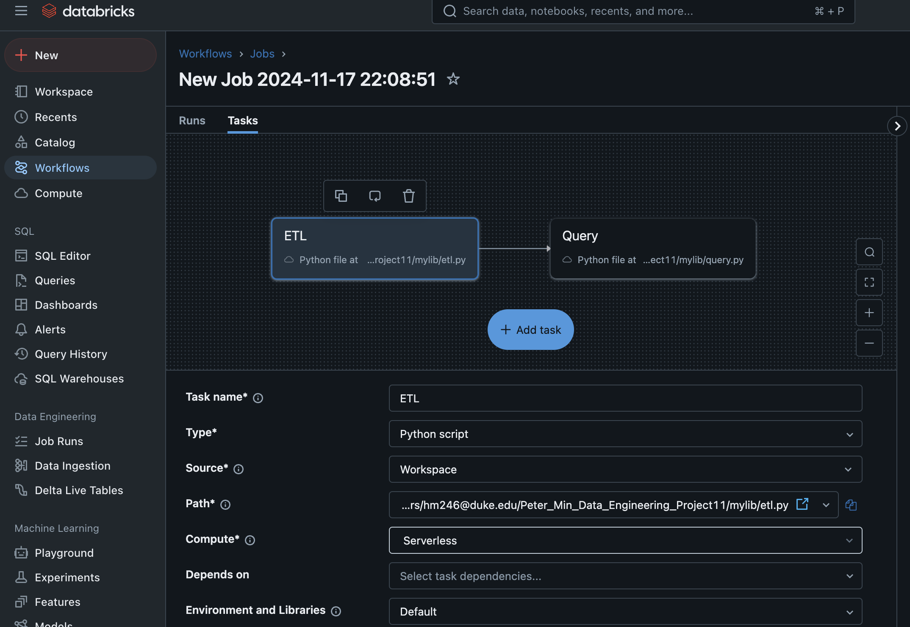
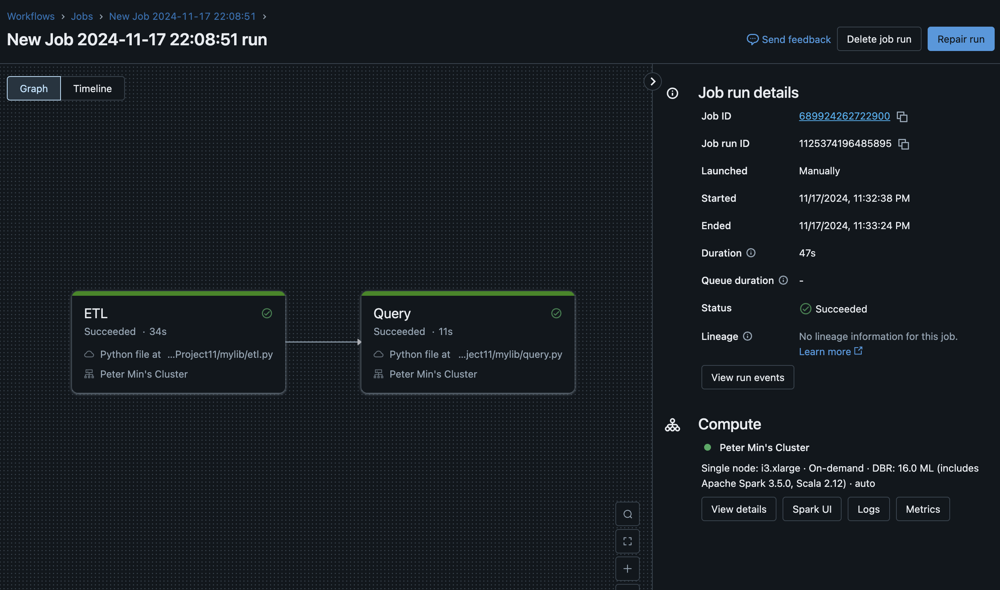
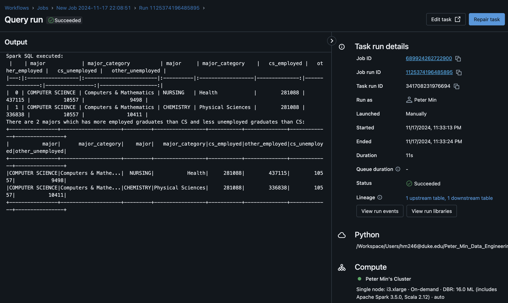

# Databricks Pipeline with Databricks
[](https://github.com/nogibjj/Peter_Min_Data_Engineering_Project11/actions/workflows/cicd.yml)

This is the README for my Databricks SQL data engineering project (mini project 11) for the IDS706 - Data Engineering Systems class at Duke University.

## Overview
The purpose of this project is to learn about and build an ETL-Query pipeline based on Python3 and Databricks SQL warehouse. Throughout this project I learned how to:
- Manage secrets with `.env` and passing secrets to GitHub machines via GitHub Actions to run tests.
- Connect to a Databricks SQL warehouse w/ credentials.
- Set up a database within a Databricks SQL warehouse.
- Upload data to and query data from this database.
- Create a data pipeline with Databricks.

## Dataset
The dataset comes from FiveThirtyEight, an election polls, politics, and analysis website now acquired by ABC news. It contains a CSV file of detailed employment information regarding graduate students from different majors. Original data source is American Community Survey 2010-2012 Public Use Microdata Series. Link: https://github.com/fivethirtyeight/data/tree/master/college-majors

## Referenced SQL Query
The complex SQL query I created aims to examine academic majors that have more employed graduates than computer science and less unemployed graduates than computer science. Here is the query used:
```
SELECT db1.major, db1.major_category, db2.major, db2.major_category, 
db1.grad_employed AS cs_employed, db2.grad_employed AS other_employed,
db1.grad_unemployed AS cs_unemployed, db2.grad_unemployed AS other_unemployed
FROM default.hm246_grademployment AS db1
CROSS JOIN default.hm246_grademployment AS db2
WHERE db1.major = 'COMPUTER SCIENCE'
AND db2.grad_employed >= db1.grad_employed
AND db2.grad_unemployed < db1.grad_unemployed;
```
By using a cross join and filtering first database with computer science majors, this query checks the values of `grad_employed` and `grad_unemployed` for all other graduates against CS major that also possess the conditions mentioned above.

## To use the pipeline:

1. Create a computing cluster on Databricks:


2. Create your ETL-query Python scripts using GitHub and import it into Databricks:


3. On **Workflows**, click on **Create job**. Configure it in a way that each component points to the corresponding part of your ETL pipeline script. This can be specified in the 'Path' field:


> [!NOTE]
> Make sure you use the computing cluster you created from step 1. above instead of the default 'Serverless'.

4. Save the job configuration. Run the job manually and you should see that it succeeds:


5. Result from my complex query can also be shown as part of the pipeline:

